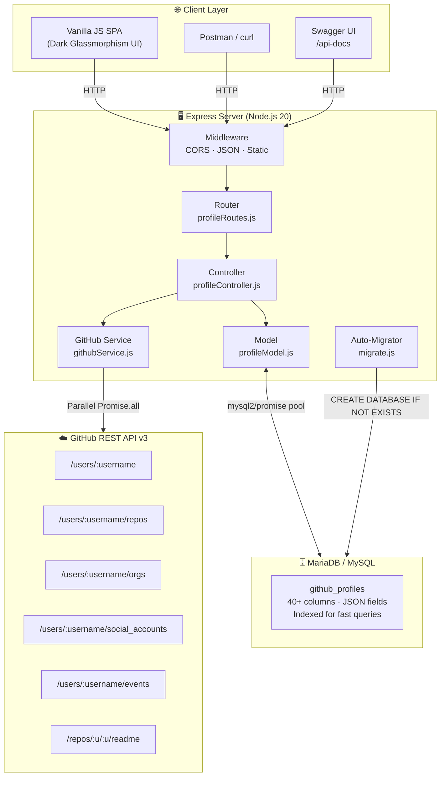
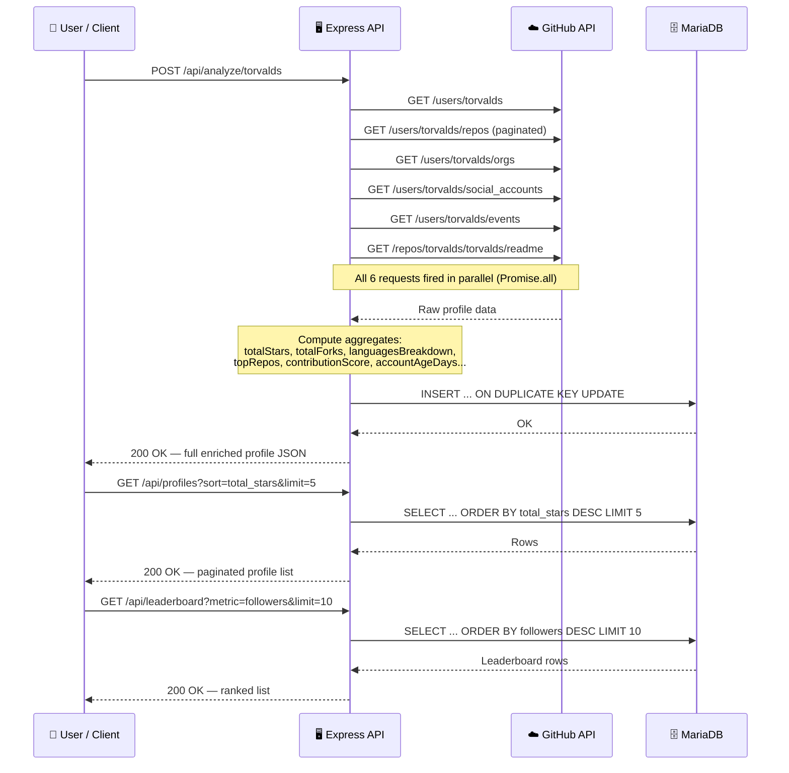
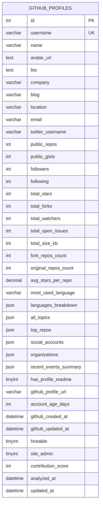

<div align="center">

# 🔭 GitLens

### GitHub Profile Analyzer — Full-Stack API + Interactive Dashboard

[](https://nodejs.org)
[](https://expressjs.com)
[](https://www.mysql.com)
[](https://docs.github.com/en/rest)
[](https://swagger.io)
[](https://www.docker.com)

**Analyze any GitHub developer in one click. Fetch 40+ metrics, compute a contribution score, visualize language breakdowns, export CSV/JSON — all from a stunning glassmorphism dashboard.**

[Live Demo →](#-live-deployment) · [API Docs →](#-interactive-api-docs) · [Quick Start →](#️-setup-instructions)

</div>

---

## 📋 Table of Contents

- [Features](#-features)
- [Extras vs Requirements](#-extras-vs-requirements)
- [Architecture](#-system-architecture)
- [Data Flow](#-data-flow)
- [API Reference](#-api-reference)
- [Database Schema](#-database-schema)
- [Setup Instructions](#️-setup-instructions)
- [Docker Deployment](#-docker--render-deployment)
- [Environment Variables](#-environment-variables)
- [Project Structure](#-project-structure)
- [Tech Stack](#-tech-stack)
- [Postman Collection](#-postman-collection)

---

## ✨ Features

### Required ✅

| Requirement | Implementation |
|---|---|
| Fetch public profile from GitHub by username | `POST /api/analyze/:username` — calls GitHub REST API v3 |
| Store useful insights | 40+ columns: repos, followers, stars, forks, languages, topics, orgs … |
| Store results in MySQL | Auto-migrated `github_profiles` table on boot |
| API to list all stored profiles | `GET /api/profiles` — paginated, sortable |
| API to fetch single profile | `GET /api/profiles/:username` — full JSON with all fields |

### Extras 🚀

| Feature | Details |
|---|---|
| **Username OR GitHub URL** | Accept `github.com/username` links — auto-parsed |
| **Leaderboard API** | Rank developers by stars, followers, repos, forks, account age |
| **Delete API** | `DELETE /api/profiles/:username` |
| **Upsert logic** | Re-analyze updates the existing row — no duplicates |
| **Contribution Score** | Custom 0–1000 score weighting stars, followers, repos, orgs, readme, events |
| **Language Breakdown** | Full ranked map of all languages across every repo |
| **Top 10 Repos** | By star count with name, description, topics, language, URL |
| **Organization Memberships** | Public orgs fetched and stored as JSON |
| **Social Accounts** | GitHub social_accounts API (Twitter, LinkedIn, etc.) |
| **Recent Activity Summary** | Last 100 events — type breakdown, active repos, last active timestamp |
| **Profile README Detection** | Detects if a `username/username` special README repo exists |
| **Stats: forks, watchers, open issues, size** | Aggregated across all repos |
| **Avg Stars per Repo** | `total_stars / total_repos` — computed metric |
| **Account Age in Days** | `(now - created_at)` for all profiles |
| **Hireable / Site Admin flags** | Stored from GitHub API |
| **401 Auto-Retry** | Token rejected? Retries unauthenticated automatically |
| **Token Validation** | Validates `ghp_`, `gho_`, `ghs_`, `github_pat_`, classic hex formats |
| **Interactive Swagger UI** | Full OpenAPI 3.0 spec at `/api-docs` — test directly from browser |
| **JSON Export** | Download full profile JSON (`username_profile_gitlens.json`) |
| **CSV Export** | Flat 27-column Excel-friendly CSV (`username_profile_gitlens.csv`) |
| **Glassmorphism Frontend** | Dark SPA: Analyze tab, Profiles list tab, Leaderboard tab |
| **Skeleton loaders + Toasts** | Polished UX with animated loading states |
| **Docker single-container** | MariaDB + Node.js in one image for Render free tier |
| **Auto DB migration** | Creates database + table on first boot — no manual SQL needed |
| **Graceful DB-offline boot** | Server starts even if DB is down; retries per-request |
| **CORS enabled** | Ready for external frontend integrations |
| **Postman Collection** | Pre-built collection with all 8 endpoints |
| **`.env.example`** | Documented environment template |

---

## 📊 Extras vs Requirements

```
Required by Assignment          │  Built in GitLens
────────────────────────────────┼──────────────────────────────────────────────────
5 basic metrics (repos,         │  40+ metrics including language maps, topics,
followers, etc.)                │  orgs, social links, events, score, readme flag
                                │
Single analyze endpoint         │  8 REST endpoints (analyze, list, single,
                                │  delete, leaderboard, health, api-docs, export)
                                │
Store in MySQL                  │  Auto-migrated schema, upsert, indexed columns,
                                │  JSON columns for nested data
                                │
Basic API                       │  Full OpenAPI 3.0 / Swagger UI interactive docs
                                │
README                          │  World-class README (you're reading it)
                                │  + Architecture diagrams + Mermaid charts
                                │
(Postman optional)              │  Postman collection included
                                │
No frontend required            │  Full SPA: glassmorphism dark UI, 3 tabs,
                                │  skeleton loaders, toasts, CSV/JSON exports
                                │
Local MySQL assumed             │  Docker: MariaDB + Node.js single container,
                                │  deployable to Render free tier with 0 paid services
```

---

## 🏗 System Architecture



---

## 🔄 Data Flow



---

## 🗄 Database Schema



Full SQL export: [`schema.sql`](./schema.sql)

**Indexes:**

| Index | Column | Purpose |
|---|---|---|
| `uq_username` | `username` | Prevent duplicate entries; enables upsert |
| `idx_followers` | `followers DESC` | Fast leaderboard queries |
| `idx_total_stars` | `total_stars DESC` | Star-ranked sorting |
| `idx_analyzed_at` | `analyzed_at DESC` | Recently analyzed first |
| `idx_contribution_score` | `contribution_score DESC` | Score leaderboard |

---

## 📖 Interactive API Docs

GitLens ships a fully compliant **OpenAPI 3.0** spec served via Swagger UI.

👉 **`http://localhost:5000/api-docs`** — browse all endpoints, schemas, parameters and run live requests from your browser.

---

## 🔌 API Reference

**Base URL:** `http://localhost:5000/api`

### `GET /health`
Server + DB health check.

```bash
curl http://localhost:5000/api/health
```

---

### `POST /analyze/:username`
Fetch GitHub profile, compute 40+ insights, store/update in DB.

- Accepts plain username: `/analyze/torvalds`
- Accepts full GitHub URL: `/analyze/github.com%2Ftorvalds`

```bash
curl -X POST http://localhost:5000/api/analyze/torvalds
```

<details>
<summary>Sample Response</summary>

```json
{
  "success": true,
  "message": "Profile for \"torvalds\" analyzed and stored successfully.",
  "data": {
    "username": "torvalds",
    "name": "Linus Torvalds",
    "public_repos": 6,
    "followers": 230000,
    "total_stars": 212000,
    "total_forks": 55000,
    "most_used_language": "C",
    "languages_breakdown": { "C": 4, "Perl": 1 },
    "contribution_score": 987,
    "account_age_days": 5700,
    "has_profile_readme": false,
    "top_repos": [
      { "name": "linux", "stars": 185000, "language": "C", "url": "..." }
    ],
    "organizations": [...],
    "social_accounts": [...],
    "recent_events_summary": { "total_events": 30, "last_active_at": "..." }
  }
}
```
</details>

---

### `GET /profiles`
List all stored profiles — paginated and sortable.

| Query Param | Default | Options |
|---|---|---|
| `page` | `1` | integer |
| `limit` | `20` | integer (max 100) |
| `sort` | `analyzed_at` | `analyzed_at` · `followers` · `total_stars` · `public_repos` · `username` |
| `order` | `DESC` | `ASC` · `DESC` |

```bash
curl "http://localhost:5000/api/profiles?sort=total_stars&limit=5&page=1"
```

---

### `GET /profiles/:username`
Full profile data for a single stored user.

```bash
curl http://localhost:5000/api/profiles/torvalds
```

---

### `DELETE /profiles/:username`
Remove a profile record from the database.

```bash
curl -X DELETE http://localhost:5000/api/profiles/torvalds
```

---

### `GET /leaderboard`
Top developers ranked by your chosen metric.

| Query Param | Default | Options |
|---|---|---|
| `metric` | `total_stars` | `total_stars` · `followers` · `public_repos` · `total_forks` · `account_age_days` · `contribution_score` |
| `limit` | `10` | integer |

```bash
curl "http://localhost:5000/api/leaderboard?metric=contribution_score&limit=10"
```

---

## ⚙️ Setup Instructions

### Prerequisites

- Node.js 18+ ([download](https://nodejs.org))
- MySQL 8 or MariaDB 10.6+ running locally
- (Optional) GitHub Personal Access Token

---

### 1. Clone & Install

```bash
git clone https://github.com/02Aditya2323/GitLens.git
cd GitLens
npm install
```

### 2. Configure Environment

```bash
cp .env.example .env
```

Edit `.env`:

```env
PORT=5000

DB_HOST=localhost
DB_PORT=3306
DB_USER=root
DB_PASSWORD=your_mysql_password
DB_NAME=github_analyzer

# Optional — strongly recommended (5000 req/hr vs 60 without)
GITHUB_TOKEN=ghp_your_personal_access_token
```

> **Getting a GitHub Token:** GitHub → Settings → Developer Settings → Personal Access Tokens → Fine-grained tokens → Generate (no special scopes needed for public data)

### 3. Start MySQL

```bash
# macOS (Homebrew)
brew services start mysql

# macOS (system)
sudo mysql.server start

# Linux / WSL
sudo service mysql start
```

> **Note:** GitLens auto-creates the `github_analyzer` database and `github_profiles` table on first startup — **no manual SQL required.**

### 4. Start the Server

```bash
npm start

# Development (auto-reload)
npm run dev
```

Expected output:

```
🔄 Booting GitLens server...
✅ MySQL connected successfully
✅ Database `github_analyzer` ensured
✅ Table `github_profiles` ensured

🚀 GitHub Profile Analyzer API running at http://localhost:5000
🌐 Frontend:       http://localhost:5000
📖 API Docs:       http://localhost:5000/api-docs
🔍 API Health:     http://localhost:5000/api/health
📊 All Profiles:   http://localhost:5000/api/profiles
🏆 Leaderboard:    http://localhost:5000/api/leaderboard
```

### 5. Open the App

Navigate to **[http://localhost:5000](http://localhost:5000)** — the full frontend loads automatically.

---

## 🐳 Docker & Render Deployment

GitLens ships a **single-container Docker image** that bundles both MariaDB and Node.js — perfect for Render's free tier (no paid Private Service needed).

### Local Docker

```bash
# Build
docker build -t gitlens .

# Run (replace password)
docker run -p 5000:5000 \
  -e DB_PASSWORD=mysecretpassword \
  -e GITHUB_TOKEN=ghp_xxx \
  gitlens
```

### Docker Compose (Local Dev with separate MySQL)

```bash
docker compose up
```

### Deploy to Render (Free Tier)

1. Push this repo to GitHub
2. Go to [render.com](https://render.com) → **New Web Service**
3. Connect your GitHub repo
4. Set **Environment** → `Docker`
5. Add a **Persistent Disk** → Mount Path: `/var/lib/mysql` (keeps your data across restarts)
6. Add the environment variables below in the Render dashboard

---

## 🔐 Environment Variables

| Variable | Required | Default | Description |
|---|---|---|---|
| `PORT` | No | `5000` | HTTP port the server listens on |
| `NODE_ENV` | No | `development` | Set `production` on Render |
| `DB_HOST` | No | `localhost` | Database host (`127.0.0.1` for Docker single-container) |
| `DB_PORT` | No | `3306` | Database port |
| `DB_USER` | No | `root` | Database user |
| `DB_PASSWORD` | **Yes** | — | Database password (set a strong value!) |
| `DB_NAME` | No | `github_analyzer` | Database name (auto-created) |
| `GITHUB_TOKEN` | Recommended | — | GitHub PAT for 5000 req/hr rate limit |

---

## 📁 Project Structure

```
GitLens/
├── src/
│   ├── server.js                   # Express entry point · boot sequence · middleware
│   ├── config/
│   │   ├── db.js                   # mysql2/promise connection pool
│   │   ├── migrate.js              # Auto-create DB + table on boot
│   │   └── swagger.js              # OpenAPI 3.0 specification
│   ├── routes/
│   │   └── profileRoutes.js        # Route definitions (8 endpoints)
│   ├── controllers/
│   │   └── profileController.js    # Request handlers · error boundaries
│   ├── services/
│   │   └── githubService.js        # GitHub API calls · aggregations · scoring
│   └── models/
│       └── profileModel.js         # All SQL queries (upsert, select, delete)
│
├── public/
│   ├── index.html                  # SPA shell · semantic HTML5
│   ├── style.css                   # Full design system · glassmorphism · animations
│   └── app.js                      # Vanilla JS app · 3 tabs · export logic
│
├── Dockerfile                      # Single-container: MariaDB + Node.js (Render free tier)
├── docker-entrypoint.sh            # Boot: start MariaDB → wait → init DB → start Node
├── docker-compose.yml              # Local dev with separate MySQL container
├── schema.sql                      # Full database schema export
├── GitLens.postman_collection.json # Postman collection (8 endpoints)
├── .env.example                    # Environment variable template
├── .gitignore
└── package.json
```

---

## 🛠 Tech Stack

| Layer | Technology | Why |
|---|---|---|
| **Runtime** | Node.js 20 | LTS, non-blocking I/O |
| **Framework** | Express.js 4.x | Minimal, flexible, industry standard |
| **Database** | MySQL 8 / MariaDB 10.6 | Relational + JSON columns |
| **DB Driver** | `mysql2/promise` | Async/await native, connection pooling |
| **HTTP Client** | Axios | Interceptors, timeout, auto-retry |
| **API Docs** | `swagger-ui-express` + OpenAPI 3.0 | Interactive browser-based testing |
| **Frontend** | Vanilla HTML/CSS/JS | Zero build step, fast, no bloat |
| **Design** | Glassmorphism · Inter + JetBrains Mono | Premium dark UI |
| **Containerization** | Docker (MariaDB in-container) | Single service, Render free tier compatible |

---

## 📮 Postman Collection

Import [`GitLens.postman_collection.json`](./GitLens.postman_collection.json) into Postman.

Set the collection variable:
- `base_url` → `http://localhost:5000`
- `username` → any GitHub username (e.g. `torvalds`, `sindresorhus`)

All 8 endpoints are pre-configured with example params and descriptions.

---

## 📝 License

MIT © 2025
